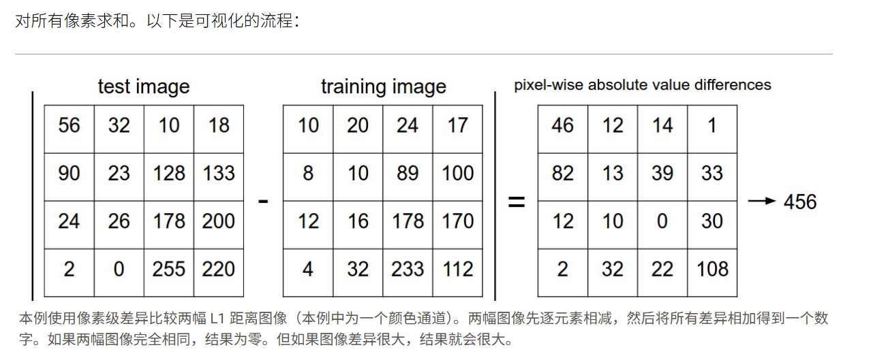
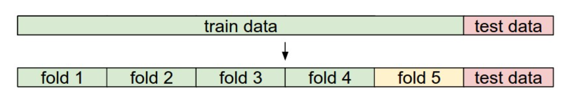

# classfication
## 最邻近分类器
 利用L1距离
 ### 具体原理：
   
 ### 代码实现：
 ```
 Xtr, Ytr, Xte, Yte = load_CIFAR10('data/cifar10/') # a magic function we provide
 # flatten out all images to be one-dimensional
 Xtr_rows = Xtr.reshape(Xtr.shape[0], 32 * 32 * 3) # Xtr_rows becomes 50000 x 3072
 Xte_rows = Xte.reshape(Xte.shape[0], 32 * 32 * 3) # Xte_rows becomes 10000 x 3072
 # 将所有图像拉成行
 # 训练和评估分类器
 nn = NearestNeighbor() # create a Nearest Neighbor classifier class
 nn.train(Xtr_rows, Ytr) # train the classifier on the training images and labels
 Yte_predict = nn.predict(Xte_rows) # predict labels on the test images
 # and now print the classification accuracy, which is the average number
 # of examples that are correctly predicted (i.e. label matches)
 print 'accuracy: %f' % ( np.mean(Yte_predict == Yte) )
 #请注意，我们将要构建的所有分类器都满足这个通用 API：它们都有一个train(X,y)函数，该函数接受数据和标签进行学习。
 #然后还有一个predict(X)函数，它接受新数据并预测标签。
 #下面是分类器本体，利用L1距离
 import numpy as np

 class NearestNeighbor(object):
  def __init__(self):
    pass

  def train(self, X, y):
    """ X is N x D where each row is an example. Y is 1-dimension of size N """
    # the nearest neighbor classifier simply remembers all the training data
    self.Xtr = X
    self.ytr = y

  def predict(self, X):
    """ X is N x D where each row is an example we wish to predict label for """
    num_test = X.shape[0]
    # lets make sure that the output type matches the input type
    Ypred = np.zeros(num_test, dtype = self.ytr.dtype)

    # loop over all test rows
    for i in range(num_test):
      # find the nearest training image to the i'th test image
      # using the L1 distance (sum of absolute value differences)
      distances = np.sum(np.abs(self.Xtr - X[i,:]), axis = 1)
    # axis=1沿行求和，同时这里用了numpy的broadcast机制简化运算。
      min_index = np.argmin(distances) # get the index with smallest distance
      Ypred[i] = self.ytr[min_index] # predict the label of the nearest example

    return Ypred

```
* 利用L2距离同理，即：
* distances = np.sqrt(np.sum(np.square(self.Xtr - X[i,:]), axis = 1))

## k-最邻近分类器
### 概念
 我们不会在训练集中寻找单张最近的图像，而是找到前k张最近的图像，并让它们对测试图像的标签进行投票。具体来说，当k = 1时，我们恢复为最近邻分类器。直观地说，k值越高，分类器对异常值的抵抗力就越强：
 * 在应用中，我们会根据实际情况来调整k的值，即涉及下面内容:超参数的调整。

##  超参数调整的验证集

 ### 超参数的概念：
 
 在训练中无法自行优化的参数

 * 特别注意：我们不能使用测试集来调整超参数！
  因为这样可能会导致过拟合。

 * 选择超参数时不能只根据训练模型的性能，还应该考虑鲁棒性即通用性。 

  * 验证超参数好的办法：
  1. （对于大规模数据）将数据分为3组，大部分训练集，以及验证集和测试集，在训练集上用不同超参，用验证集评估，选择一组最后的超参不变，最后用测试集测出数据。（前面不能接触到测试集）

  2. 对于小规模数据，进行交叉验证：
  结合我们之前的示例，我们的想法是，不是任意选择前 1000 个数据点作为验证集，其余作为训练集，而是通过迭代不同的验证集并计算这些验证集的平均性能
  
