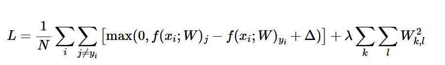
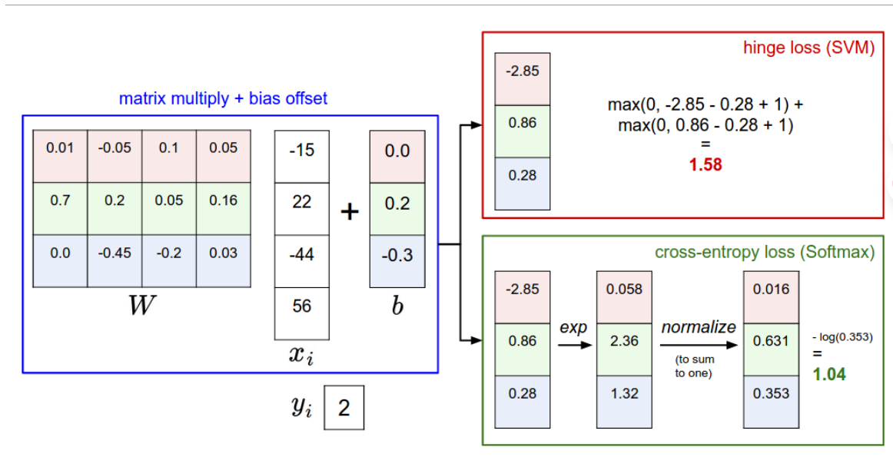

# Linear Classification
 ## 分数函数
  f（x,W）=Wx+b 
  * 首先，请注意，单矩阵乘法 Wxi有效地并行计算了 10 个单独的分类器（每个类一个），其中每个分类器是一行 W。每一类分类器同image向量进行点积，可以用来衡量相似度。
  * 这种方法的一个优点是训练数据用于学习参数 W，b，但一旦学习完成，我们可以丢弃整个训练集并仅保留学习到的参数。这是因为新的测试图像可以通过函数简单地转发并根据计算的分数进行分类。
  * 可以把W中的每一行看作坐标的变换。
 如果没有b那么所有行的分类器都会穿过原点。

 需要学会将偏差向量b折叠到权重矩阵W的方法

 ### 利用模板匹配理论看这个函数
 相当于W中的每一行相当于一个类别的模板，这里利用内积去判断对应的相似度，也就是相当于之前的L1、L2距离。

 ## 损失函数

 ### SVM 损失

 * SVM 损失的设置使得 SVM“希望”每个图像的正确类比不正确的类高出一定固定的分数 Δ

 * 这是人为的设定一个边界，只要超过边界，正确类分数更高不会改变损失函数大小了。

 （有时也会用平方版，L2-SVM，它更加关注于部分极大分数的错误值）

 #### 正则化

 ##### 目的：
 在一组线性的W中，找到模型简单且对于训练集拟合程度最好的那一个。

 * 关于正则化有一个问题：因为不同正则化函数对于“复杂”有着不同的定义，所以对于一个特定的场景，如何确定一个最好的正则化函数，使模型拟合程度最好。 

 1. 为了建立一个较简单的模型，避免过拟合，提升模型的鲁棒性

 * 它和损失函数前半部分的区别是损失函数关注的是偏差，而它更加关注方差

 2. 最常见的是L2正则化，它通过对所有参数的逐元素二次惩罚来阻止大权重

 完整的SVM损失公式如下：

 

 * 如您所见，我们将正则化惩罚附加到 损失目标，由超参数加权 λ 。没有简单的方法来设置这个超参数，它通常通过交叉验证来确定。

### 具体的损失函数代码：
 ```
 def L_i(x, y, W):
  """
  unvectorized version. Compute the multiclass svm loss for a single example (x,y)
  - x is a column vector representing an image (e.g. 3073 x 1 in CIFAR-10)
    with an appended bias dimension in the 3073-rd position (i.e. bias trick)
  - y is an integer giving index of correct class (e.g. between 0 and 9 in CIFAR-10)
  - W is the weight matrix (e.g. 10 x 3073 in CIFAR-10)
  """
  delta = 1.0 # see notes about delta later in this section
  scores = W.dot(x) # scores becomes of size 10 x 1, the scores for each class
  correct_class_score = scores[y]
  D = W.shape[0] # number of classes, e.g. 10
  loss_i = 0.0
  for j in range(D): # iterate over all wrong classes
    if j == y:
      # skip for the true class to only loop over incorrect classes
      continue
    # accumulate loss for the i-th example
    loss_i += max(0, scores[j] - correct_class_score + delta)
  return loss_i

def L_i_vectorized(x, y, W):
  """
  A faster half-vectorized implementation. half-vectorized
  refers to the fact that for a single example the implementation contains
  no for loops, but there is still one loop over the examples (outside this function)
  """
  delta = 1.0
  scores = W.dot(x)
  # compute the margins for all classes in one vector operation
  margins = np.maximum(0, scores - scores[y] + delta)
  # on y-th position scores[y] - scores[y] canceled and gave delta. We want
  # to ignore the y-th position and only consider margin on max wrong class
  margins[y] = 0
  loss_i = np.sum(margins)
  return loss_i

def L(X, y, W):
  """
  fully-vectorized implementation :
  - X holds all the training examples as columns (e.g. 3073 x 50,000 in CIFAR-10)
  - y is array of integers specifying correct class (e.g. 50,000-D array)
  - W are weights (e.g. 10 x 3073)
  """
  # evaluate loss over all examples in X without using any for loops
  # left as exercise to reader in the assignment
 ```

 ## softmax 分类器

  * 在softmax中“分数”有了具体的意义，它变成了概率

  它的损失又叫交叉熵损失。

  * 在将分数转化为概率时，我们可以×C来控制数值的稳定性

## SVM 与 softmax
 区别：

 

 SVM对于满足条件的分数细节并不关系，而softmax永远不会对于它产生的分数满意


