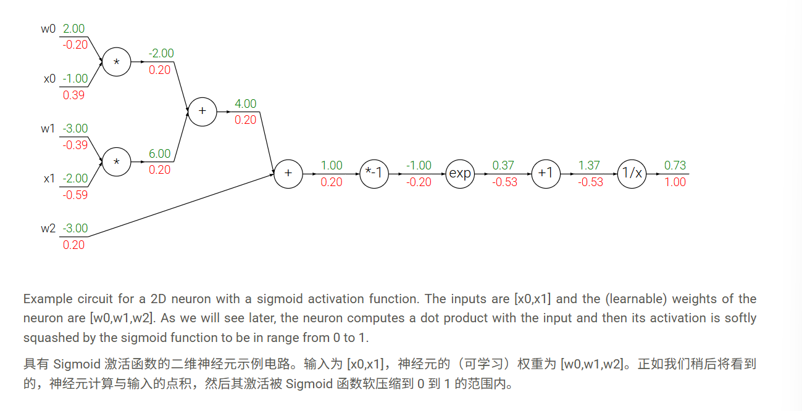

# 反向传播法

 ## 利用反向传播技术计算各个变量得到梯度

 1. 先画出损失函数的计算图

 2. 从后往前计算出每一个节点输出关于输入的梯度（本地梯度）

 3. 利用链式法则即可计算出。 

 * 当一个节点连接多个节点时，梯度在这个节点进行累加

 可以画类似这样的图：

 

 反向传播代码：

 ```
 w = [2,-3,-3] # assume some random weights and data
 x = [-1, -2]

 # forward pass
 dot = w[0]*x[0] + w[1]*x[1] + w[2]
 f = 1.0 / (1 + math.exp(-dot)) # sigmoid function

 # backward pass through the neuron (backpropagation)
 ddot = (1 - f) * f # gradient on dot variable, using the sigmoid gradient derivation
 dx = [w[0] * ddot, w[1] * ddot] # backprop into x
 dw = [x[0] * ddot, x[1] * ddot, 1.0 * ddot] # backprop into w
 # we're done! we have the gradients on the inputs to the circuit
 ```
 * 这里可以体现预处理的重要性！

 ## 向量化操作的梯度

 ```
 # forward pass
 W = np.random.randn(5, 10)
 X = np.random.randn(10, 3)
 D = W.dot(X)

 # now suppose we had the gradient on D from above in the circuit
 dD = np.random.randn(*D.shape) # same shape as D
 dW = dD.dot(X.T) #.T gives the transpose of the matrix
 dX = W.T.dot(dD)
 ```
 * tip:使用维度分析！请注意，您无需记住 dW 和 dX 的表达式，因为它们很容易根据维度重新推导。例如，我们知道权重 dW 上的梯度在计算后必须与 W 的大小相同，并且它必须依赖于 X 和 dD 的矩阵乘法（就像 X,W 都是单个数字而不是矩阵的情况一样）。总是只有一种方法可以实现维度匹配。例如， X 的大小是 [10 x 3]， dD 的大小是 [5 x 3]，所以如果我们想要 dW 并且 W 的形状是 [5 x 10]，那么实现这一点的唯一方法是使用 dD.dot(X.T) ，如上所示。

 * tip:使用小型、明确的示例。有些人可能一开始会觉得很难推导某些向量化表达式的梯度更新。我们的建议是明确写出一个最小的向量化示例，在纸上推导梯度，然后将模式推广到其高效的向量化形式。