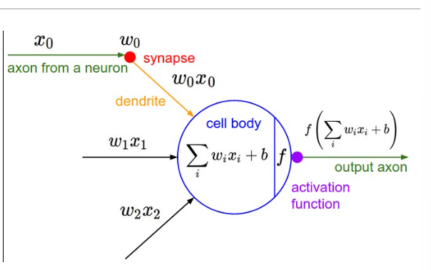
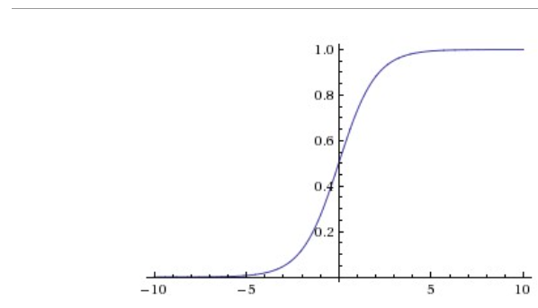
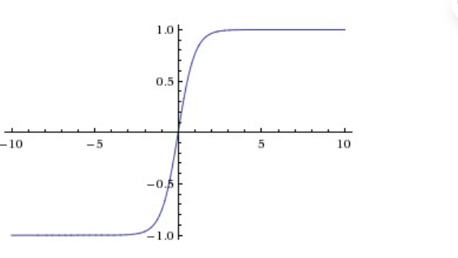
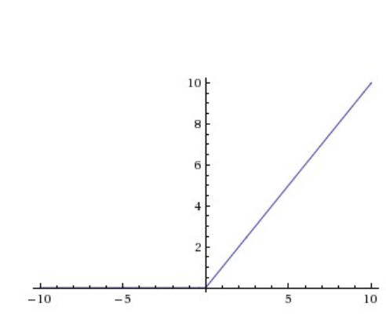
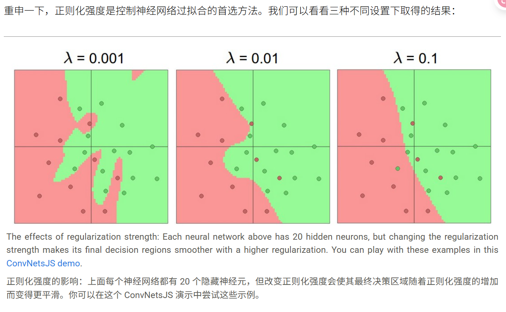

# 神经网络架构

 如果想要搭建多层神经网络，以之前的线性分类器作类比，需要引入非线性函数(max())

 * 如果不引入非线性函数，那么两个矩阵将会被合成为一个矩阵

 ## 建模单个神经元

 单个神经元的数学模型：

 

 在单个神经元输出上使用适当的损失函数，可以将单个神经元转化为二元线性分类器（因为单个神经元只有单个输出）

 * 正则化可以被解释为逐渐遗忘

 ## 激活函数：

 ### Sigmoid函数:
 
 图像：

 

 缺点：

 1. Sigmoid 激活函数会饱和并“杀死”梯度。Sigmoid 神经元的一个非常不理想的特性是，当神经元的激活值在 0 或 1 的任一端饱和时，这些区域的梯度几乎为零。回想一下，在反向传播过程中，这个（局部）梯度将与该门输出的梯度相乘，以计算整个目标函数。因此，如果局部梯度非常小，它将有效地“杀死”梯度，几乎没有信号会通过神经元流向其权重，并递归地流向其数据。此外，在初始化 Sigmoid 神经元的权重时，必须格外小心，以防止饱和。例如，如果初始权重过大，那么大多数神经元将变得饱和，网络将几乎无法学习。

 2. Sigmoid 的输出不是零中心的。这是不理想的，因为神经网络中后续处理层（稍后会详细介绍）中的神经元将接收到非零中心的数据。这会对梯度下降期间的动态产生影响，因为如果进入神经元的数据始终为正（例如，\(x_i\) 在 \(x\) 中），那么权重 \(w\) 上的梯度在反向传播期间将要么全部为正，要么全部为负（取决于整个表达式 \(f\) 的梯度）。这可能会在权重的梯度更新中引入不希望的锯齿状动态。然而，请注意，一旦这些梯度在批次数据中累加起来，权重的最终更新可以具有可变的符号，这在一定程度上缓解了这个问题。因此，这是一个不便之处，但与上述饱和激活问题相比，其后果不那么严重。

 ### Tanh函数

 图像：

 

 虽然是0中心，但是还是会饱和

 ### ReLU函数

 图像：

 

 优点：

 1. 经发现，与 sigmoid/tanh 函数相比，它能极大地加速（例如在 Krizhevsky 等人的研究中达到 6 倍）随机梯度下降的收敛。有人认为这是由于其线性、非饱和的形式。

 2. 与涉及昂贵操作（指数等）的 tanh/sigmoid 神经元相比，ReLU 可以通过简单地将激活矩阵在零点进行阈值处理来实现。

 缺点：

 不幸的是，ReLU 单元在训练过程中可能很脆弱，并且可能“死亡”。例如，流经 ReLU 神经元的大梯度可能导致权重更新，使得该神经元再也不会在任何数据点上激活。如果发生这种情况，那么从那时起，流经该单元的梯度将永远为零。也就是说，ReLU 单元在训练过程中可能不可逆地死亡，因为它们可能脱离数据流形。例如，如果学习率设置过高，你可能会发现网络中多达 40% 的部分可能“死亡”（即在整个训练数据集中从未激活的神经元）。如果学习率设置得当，这就不太常成为问题。

 * 就是说因为它当x<0时斜率为0，所以导致梯度传不回去，造成“死亡”。

 * 总结：“我应该使用哪种神经元类型？”使用 ReLU 非线性，小心你的学习率，并可能监控网络中“死亡”单元的比例。如果这让你担心，可以尝试 Leaky ReLU 或 Maxout。永远不要使用 sigmoid。可以尝试 tanh，但预计它比 ReLU/Maxout 效果差。

 ## 神经网络架构

 命名约定：请注意，当我们说 N 层神经网络时，我们不计算输入层。因此，单层神经网络描述的是没有隐藏层的网络（输入直接映射到输出）。从这个意义上说，你有时会听到人们说逻辑回归或支持向量机（SVM）只是单层神经网络的特例。你可能还会听到这些网络被交替地称为“人工神经网络”（ANN）或“多层感知器”（MLP）。许多人不喜欢神经网络与真实大脑之间的类比，更喜欢将神经元称为单元。

 * 几层神经网络就是做了几次矩阵运算

 * 一个矩阵用来储存一层的连接

 * 神经网络可以逼近任何连续函数（有一个隐藏层的神经网络就可以）

 顺便一提，在实践中，3 层神经网络通常会优于 2 层网络，但更深的网络（4、5、6 层）很少能带来显著的提升。这与卷积网络形成鲜明对比，在卷积网络中，深度被认为是构建良好识别系统极其重要的组成部分（例如，大约 10 个可学习层）。对此观察的一种解释是，图像包含层次结构（例如，人脸由眼睛组成，眼睛由边缘组成等），因此多层处理对于这种数据领域来说具有直观意义

 * 阅读deep Learning 6.4章。

 ## 设置层数及其大小

 * 如果层数过多同样可能会导致过拟合。

 * 层数较少同样可能会lead to 更好的泛化能力。

 根据我们上面的讨论，如果数据不够复杂，为了防止过拟合，似乎可以优先选择较小的神经网络。然而，这是不正确的——还有许多其他更好的方法可以防止神经网络中的过拟合，我们将在后面讨论（例如 L2 正则化、Dropout、输入噪声）。实际上，总是最好使用这些方法来控制过拟合，而不是通过调整神经元的数量。

 这背后的微妙原因是，较小的网络更难用梯度下降等局部方法进行训练：很明显，它们的损失函数局部最小值相对较少，但事实证明，这些最小值中的许多更容易收敛，而且它们很糟糕（即损失很高）。相反，较大的神经网络包含明显更多的局部最小值，但这些最小值在实际损失方面却要好得多。由于神经网络是非凸的，因此很难从数学上研究这些特性，但已经有一些尝试来理解这些目标函数，例如最近的论文《多层网络的损失曲面》。实际上，你会发现，如果你训练一个小型网络，最终损失可能会显示出很大的方差——在某些情况下，你很幸运地收敛到一个好的地方，但在某些情况下，你会被困在一个糟糕的局部最小值中。另一方面，如果你训练一个大型网络，你会开始找到许多不同的解决方案，但最终实现的损失的方差会小得多。换句话说，所有解决方案都差不多好，并且较少依赖于随机初始化的运气。

 

 * key:你不应该因为害怕过拟合而使用较小的网络。相反，你应该使用计算预算允许的最大神经网络，并使用其他正则化技术来控制过拟合。