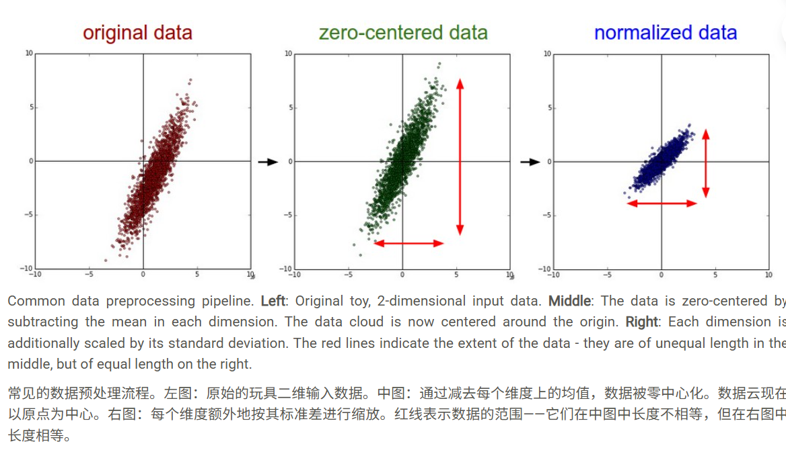
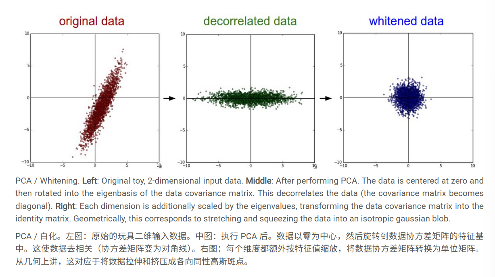

# 设置数据和模型
 
 ## 数据预处理

 ### 均值减法：

 从数据的每个单独特征中减去均值，其几何解释是将数据云沿每个维度围绕原点居中。

 * 归一化：实现这种归一化有两种常见方法。一种是在数据零中心后，将每个维度除以其标准差：（ X /= np.std(X, axis = 0) ）。另一种预处理形式是将每个维度归一化，使该维度的最小值和最大值分别为 -1 和 1。只有当你认为不同的输入特征具有不同的尺度（或单位），但它们对学习算法的重要性大致相等时，才应该应用这种预处理。对于图像，像素的相对尺度已经大致相等（范围从 0 到 255），因此没有严格必要执行此额外的预处理步骤。

 

 ### PCA

 （主成分分析）:数据先进行中心化，然后，我们可以计算协方差矩阵，它告诉我们数据中的相关结构：

 ```
 # Assume input data matrix X of size [N x D]
 X -= np.mean(X, axis = 0) # zero-center the data (important)
 cov = np.dot(X.T, X) / X.shape[0] # get the data covariance matrix
 ```

 数据协方差矩阵的 (i,j) 元素包含数据第 i 维和第 j 维之间的协方差。特别是，该矩阵的对角线包含方差。此外，协方差矩阵是对称的半正定矩阵。我们可以计算数据协方差矩阵的 SVD 分解：

 ```
 U,S,V = np.linalg.svd(cov)
 ```
 其中 U 的列是特征向量， S 是奇异值的 1 维数组。为了使数据去相关，我们将原始（但已零中心化）数据投影到特征基中：

 ```
 Xrot = np.dot(X, U) # decorrelate the data
 ```

 请注意，\(U\) 的列是一组正交向量（范数为 1，且彼此正交），因此它们可以被视为基向量。因此，投影对应于 \(X\) 中数据的旋转，使得新轴是特征向量。如果我们计算 \(X\) 的协方差矩阵，我们会发现它现在是对角矩阵。\(np.linalg.eigh\) 的一个很好的特性是，在其返回值 \(U\) 中，特征向量列按其特征值排序。我们可以利用这一点，通过仅使用前几个特征向量来降低数据的维度，并丢弃数据没有方差的维度。这有时也称为主成分分析（PCA）降维：

 ```
 Xrot_reduced = np.dot(X, U[:,:100]) # Xrot_reduced becomes [N x 100]
 ```
 
 经过此操作，我们将原始大小为 [N x D] 的数据集缩减为大小为 [N x 100] 的数据集，保留了数据中包含最大方差的 100 个维度。通常情况下，通过在 PCA 降维后的数据集上训练线性分类器或神经网络，可以获得非常好的性能，从而节省空间和时间。

 ### 白化

 白化操作将数据置于特征基中，并将每个维度除以特征值以标准化尺度。这种变换的几何解释是，如果输入数据是多变量高斯分布，则白化后的数据将是均值为零、协方差矩阵为单位矩阵的高斯分布。此步骤将采用以下形式：

 ```
 # whiten the data:
 # divide by the eigenvalues (which are square roots of the singular values)
 Xwhite = Xrot / np.sqrt(S + 1e-5)
 ```  

 * 变换缺点：它会极大地夸大数据中的噪声，因为它将所有维度（包括主要由噪声组成的微小方差的不相关维度）拉伸到输入中相等的大小。这在实践中可以通过更强的平滑（即增加 1e-5 到更大的数字）来缓解。

 

 * 注意：关于预处理，重要的一点是，任何预处理统计数据（例如数据均值）都必须仅在训练数据上计算，然后应用于验证/测试数据。例如，计算均值并将其从整个数据集的每张图像中减去，然后将数据分成训练/验证/测试集，这将是一个错误。相反，均值必须仅在训练数据上计算，然后从所有数据集（训练/验证/测试）中等量减去。

 ### 总结：

 #### PCA：

 降维，去相关。它通过线性变换，将一组可能相关的原始特征，转换为一组线性不相关的主成分

 优点：

 1. 降维：最主要的优点。能有效减少特征数量，解决“维度灾难”，提升后续模型的训练速度，并有助于数据可视化（例如降到2D或3D）。

 2. 去相关：产生的主成分之间是线性不相关的，这对于一些假设特征独立的算法（如朴素贝叶斯）非常有利。

 3. 降噪：通常方差较小的主成分对应的是数据中的噪声。通过舍弃这些成分，可以在一定程度上实现数据降噪。

 4. 无监督：PCA是一种无监督学习方法，不需要数据标签，应用范围广泛。

 缺点：

 1. 可解释性差：降维后的主成分是原始特征的线性组合，通常很难赋予其明确的物理或现实意义，降低了模型的可解释性。

 2. 线性限制：PCA是一种线性变换，它无法捕捉特征间的非线性关系。对于本身是流形结构或高度非线性的数据，降维效果可能不佳。

 3. 对数据缩放敏感：如果原始特征的量纲（单位）不同，方差大的特征会主导PCA的结果。因此，在进行PCA之前，通常必须对数据进行标准化或归一化。

 4. 方差最大化非最优：PCA以方差最大化为目标，但在某些场景下（尤其是分类任务），方差小的方向可能才是区分不同类别的关键信息，而PCA可能会将其当作噪声舍弃。

 #### 白化：

 建立在PCA的基础上，目标是不仅去除特征间的线性相关性，还要使得所有特征的方差都为1。

 优点：

 1. 特征等权：白化使得所有特征处于同等地位（方差相同），可以防止模型（特别是神经网络、K-Means等）因特征尺度不同而对某些特征产生偏好。

 2. 加速模型收敛：对于梯度下降等优化算法，一个“球形”的输入数据分布对应着一个更规则、更圆的损失函数等高线图。这使得优化器可以更直接、更快速地找到最优解，从而加速模型的收敛过程。

 3. 完全去相关：达到了特征处理的理想状态之一，对于很多算法的性能有正面影响。

 缺点：

 1. 可能放大噪声：在方差归一化步骤中，如果某个主成分的方差（特征值）非常小（可能代表噪声），用它来做除数会极大地放大这个成分的噪声影响。

 2. 计算成本更高：需要完整的PCA计算过程，并额外增加了缩放步骤。

 3. 可解释性更差：如果说PCA的可解释性已经很差，那么经过缩放的白化数据就更加抽象，几乎完全失去了原始的物理意义。

 4. 对异常值敏感：方差和均值的计算对异常值敏感，白化过程可能会加剧异常值对数据整体分布的影响。

 ## 权重初始化

 1. 需要用随机数来初始化权重

 2. 用1/sqrt(n) 校准方差。随机初始化的神经元输出分布的方差会随着输入数量的增加而增大。事实证明，我们可以通过将其权重向量除以其扇入（即输入数量）的平方根，将每个神经元输出的方差归一化为 1。也就是说，推荐的启发式方法是将每个神经元的权重向量初始化为： w = np.random.randn(n) / sqrt(n) ，其中 n 是其输入数量。这确保了网络中所有神经元最初具有大致相同的输出分布，并凭经验提高了收敛速度。

 * 当用于ReLU时，用sqrt(2.0/n)

 ## 偏置初始化

 一般初始化为0.

 ## BN（批量归一化）

 目的是使梯度维持稳定，从而可以更好的训练

 在实践中，使用批量归一化的网络对不良初始化具有显著的鲁棒性。此外，批量归一化可以解释为在网络的每一层进行预处理，但以可微分的方式集成到网络本身中。

 (详情查看论文BN)

 它也可以作为正则化的一种处理方式。

 ## 正则化

 ### 最大范数约束

 对每个神经元的权重向量的幅度施加一个绝对上限，并使用投影梯度下降来强制执行该约束。在实践中，这相当于正常执行参数更新，然后通过将每个神经元的权重向量 w 钳位以满足 ||w||2< c来强制执行约束。 c的典型值约为 3 或 4。有些人报告说使用这种形式的正则化时有所改进。它的一个吸引人的特性是，即使学习率设置得太高，网络也不会“爆炸”，因为更新始终是有界的。

 ### Dropout

 在训练期间，Dropout 的实现方式是：以某个概率 p（一个超参数）保持神经元激活，否则将其设置为零。
 
 一个示例性的 3 层神经网络中的普通 Dropout 将按如下方式实现：

 ```
 """ Vanilla Dropout: Not recommended implementation (see notes below) """

 p = 0.5 # probability of keeping a unit active. higher = less dropout

 def train_step(X):
  """ X contains the data """
  
  # forward pass for example 3-layer neural network
  H1 = np.maximum(0, np.dot(W1, X) + b1)
  U1 = np.random.rand(*H1.shape) < p # first dropout mask
  H1 *= U1 # drop!
  H2 = np.maximum(0, np.dot(W2, H1) + b2)
  U2 = np.random.rand(*H2.shape) < p # second dropout mask
  H2 *= U2 # drop!
  out = np.dot(W3, H2) + b3
  
  # backward pass: compute gradients... (not shown)
  # perform parameter update... (not shown)
  
 def predict(X):
  # ensembled forward pass
  H1 = np.maximum(0, np.dot(W1, X) + b1) * p # NOTE: scale the activations
  H2 = np.maximum(0, np.dot(W2, H1) + b2) * p # NOTE: scale the activations
  out = np.dot(W3, H2) + b3
 ```

 运用反向dropout，使测试代码不变：

 ```
""" 
 Inverted Dropout: Recommended implementation example.
 We drop and scale at train time and don't do anything at test time.
 """

 p = 0.5 # probability of keeping a unit active. higher = less dropout

 def train_step(X):
  # forward pass for example 3-layer neural network
  H1 = np.maximum(0, np.dot(W1, X) + b1)
  U1 = (np.random.rand(*H1.shape) < p) / p # first dropout mask. Notice /p!
  H1 *= U1 # drop!
  H2 = np.maximum(0, np.dot(W2, H1) + b2)
  U2 = (np.random.rand(*H2.shape) < p) / p # second dropout mask. Notice /p!
  H2 *= U2 # drop!
  out = np.dot(W3, H2) + b3
  
  # backward pass: compute gradients... (not shown)
  # perform parameter update... (not shown)
  
 def predict(X):
  # ensembled forward pass
  H1 = np.maximum(0, np.dot(W1, X) + b1) # no scaling necessary
  H2 = np.maximum(0, np.dot(W2, H1) + b2)
  out = np.dot(W3, H2) + b3
 ```

 详细内容看dropout的论文。

 在实践中：最常见的是使用单一的、全局的 L2 正则化强度，并通过交叉验证进行调整。通常还会结合在所有层之后应用的 dropout。 p=0.5 的值是一个合理的默认值，但可以在验证数据上进行调整。

 ## 损失函数

 1. SVM函数

 2. softmax函数

 3. L2（但是较为脆弱）