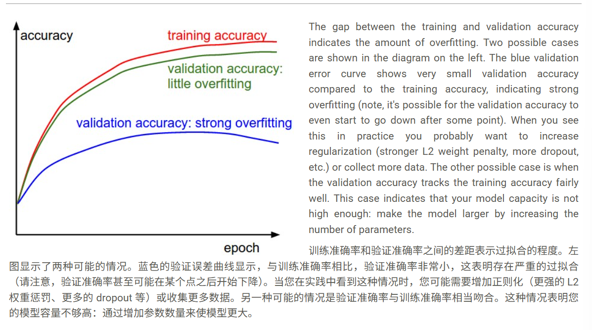

# 学习参数和寻找超参数

 ## 梯度检查

 使用相对误差进行比较：

 

 在实际中：

 1. 相对误差 > 1e-2 通常意味着梯度可能错误

 2. 1e-2 > 相对误差 > 1e-4 应该让你感到不安

 3. 1e-4 > 相对误差对于带有“尖角”（kinks）的目标函数通常是可以接受的。但如果没有“尖角”（例如使用 tanh 非线性和 softmax），那么 1e-4 就太高了。

 4. 1e-7 或更小，你应该感到满意

 几个常见的问题：

 1. 网络越深，相对误差会越高。因此，如果你正在对一个 10 层网络的输入数据进行梯度检查，1e-2 的相对误差可能是可以接受的，因为误差会在传播过程中累积。相反，对于一个单一的可微函数，1e-2 的误差可能表明梯度不正确。

 2. 目标函数中的“扭结”。在梯度检查过程中需要注意的一个不准确性来源是“扭结”问题。扭结指的是目标函数中不可微分的部分，由 ReLU（ max(0,x) ）、SVM 损失、Maxout 神经元等函数引入。此时数值梯度和解析梯度不同是正常的

 3. 小心步长 h。并非越小越好，因为当 h非常小时，你可能会遇到数值精度问题。有时当梯度检查不通过时，你可能会将 h 改为 1e-4 或 1e-6，然后梯度突然就正确了。

 4. 不要一开始就进行梯度检查，可以等损失开始下降后进行梯度检查

 5. 建议首先关闭正则化，单独检查数据损失，然后独立检查正则化项

 6. 请记住关闭 dropout/数据增强。执行梯度检查时，请记住关闭网络中的任何非确定性效应，例如 dropout、随机数据增强等。否则，这些效应在估计数值梯度时会明显引入巨大误差。一个更好的解决方案可能是在评估 f(x+h)和 f(x−h)以及评估解析梯度之前，强制使用特定的随机种子。

 ## 学习之前的正确性检查技巧

  1. 先去掉正则化项，确定在随机参数初始化权重的时候得到的损失是正确的

  * 增加正则化项损失应该会增大。

  2. 过拟合一小部分数据。在完整数据集上训练之前，尝试在数据的一小部分（例如 20 个样本）上进行训练，并确保你可以达到零损失。对于这个实验，最好也将正则化设置为零，否则这可能会阻止你获得零成本。除非你通过了小数据集的这个健全性检查，否则不值得继续处理完整数据集。

  ## 照看训练过程

  1. 跟踪损失函数(首先应该确定学习率超参数)：

  

  * 损失函数中的“抖动”量与批量大小有关。当批量大小为 1 时，抖动会相对较高。当批量大小为整个数据集时，抖动会最小，因为每次梯度更新都应该单调地改善损失函数（除非学习率设置得太高）。

  2. 验证准确率

  

  3. 更新量与权重之比

  一个粗略的经验法则是，这个比率应该在 1e-3 左右。如果低于这个值，那么学习率可能太低。如果高于这个值，那么学习率可能太高。

 ```
 # assume parameter vector W and its gradient vector dW
 param_scale = np.linalg.norm(W.ravel())
 update = -learning_rate*dW # simple SGD update
 update_scale = np.linalg.norm(update.ravel())
 W += update # the actual update
 print update_scale / param_scale # want ~1e-3

 ```

  * 不正确的初始化会减缓甚至完全停止学习过程。幸运的是，这个问题相对容易诊断。一种方法是绘制网络所有层的激活/梯度直方图。直观地说，看到任何奇怪的分布都不是一个好兆头——例如，对于 tanh 神经元，我们希望看到神经元激活分布在 [-1,1] 的整个范围内，而不是看到所有神经元输出零，或者所有神经元完全饱和在 -1 或 1。

 ## 参数更新

 ### SGD可能出现的问题

 1. 关键原因在于这个方法只有一个全局的学习率，而通常在不同方向上的斜率是差别很大的，这样的话，过高的学习率会导致在高斜率的方向直接冲过头，导致优化速度变慢。而过低的学习率又会导致在斜率低的方向进步微乎其微。

 2. 无法正确处理局部最小点，或者鞍点 

 3. 由于是随机采样小批量，所以噪声问题也会存在 

 * 加入一个动量可以有效的解决这一些问题

 1.  动量更新是另一种方法，它几乎总能在深度网络上获得更好的收敛速度。这种更新可以从优化问题的物理角度来解释。特别是，损失可以被解释为丘陵地形的高度（因此也与势能相关，因为 U=mgh 和 U∝h）。用随机数初始化参数相当于将一个初始速度为零的粒子放置在某个位置。优化过程可以看作是模拟参数向量（即粒子）在地形上滚动的过程。

 2. 由于粒子上的力与势能的梯度相关（即 F=−∇U ），因此粒子感受到的力正是损失函数的（负）梯度。此外， F=ma ，因此（负）梯度在这种观点下与粒子的加速度成正比。请注意，这与上面所示的 SGD 更新不同，在 SGD 更新中，梯度直接积分位置。相反，物理观点建议的更新是梯度只直接影响速度，而速度又对位置产生影响：

 ```
 # Momentum update
 v = mu * v - learning_rate * dx # integrate velocity
 x += v # integrate position
 ```

 * 这里的mu更加类似于惯性，在开始时调低 因为系统阻力大，主要听从当前梯度的指挥，小心翼翼地在复杂的环境中探索正确的下降方向。（开始时比较“崎岖”）；在后期调高，因为当训练进行到后期阶段，模型已经比较接近最优点了。此时的损失函数曲面通常是比较平坦的，如果还调低，使摩擦大，那么前进的速度就会很慢，所以要调高惯性，加速前进。

 Nesterov 动量是动量更新的一个略有不同但最近越来越受欢迎的版本。它对凸函数具有更强的理论收敛保证，并且在实践中也始终比标准动量表现稍好。

 * Nesterov 动量背后的核心思想是，当当前参数向量位于某个位置 x 时，根据上面的动量更新，我们知道仅动量项（即忽略带有梯度的第二项）将使参数向量移动 mu * v 。因此，如果我们要计算梯度，我们可以将未来的近似位置 x + mu * v 视为一个“前瞻”——这是我们即将到达的位置附近的一个点。因此，在 x + mu * v 而不是在“旧/过时”位置 x 计算梯度是有意义的。

 

 也就是说，用一种略显笨拙的符号表示，我们希望这样做：

 ```
 x_ahead = x + mu * v
 # evaluate dx_ahead (the gradient at x_ahead instead of at x)
 v = mu * v - learning_rate * dx_ahead
 x += v
 ```

 为了在实践中减少计算量，我们变换写法：

 ```
 v_prev = v # back this up
 v = mu * v - learning_rate * dx # velocity update stays the same
 x += -mu * v_prev + (1 + mu) * v # position update changes form
 ```

 ## 学习率退火

 在训练深度网络时，通常有助于随着时间推移对学习率进行退火。当学习率很高时，系统包含过多的动能，参数向量会混乱地跳动，无法稳定地进入损失函数更深但更窄的部分。知道何时衰减学习率可能很棘手：衰减得太慢，你将浪费计算，长时间混乱地跳动，收效甚微。但衰减得太快，系统会冷却过快，无法达到最佳位置。有三种常见的学习率衰减实现方式：

 1. 步进衰减：每隔几个周期将学习率降低一定因子。典型值可能是每 5 个周期将学习率降低一半，或每 20 个周期降低 0.1。这些数字很大程度上取决于问题的类型和模型。你在实践中可能会看到的一种启发式方法是，在固定学习率训练时观察验证误差，并在验证误差停止改善时将学习率降低一个常数（例如 0.5）。

 2. 指数衰减的数学形式为 α=α0e−kt ，其中 α0,k是超参数， t是迭代次数（但你也可以使用 epoch 作为单位）。

 3. 1/t 衰减的数学形式为 α=α0/(1+kt) ，其中 a0,k 是超参数， t 是迭代次数。

 ### 逐参数自适应学习率方法

 #### Adagrad 
 
 是一种自适应学习率方法，最初由 Duchi 等人提出。

 ```
 # Assume the gradient dx and parameter vector x
 cache += dx**2
 x += - learning_rate * dx / (np.sqrt(cache) + eps)
 ```

 * Adagrad 的一个缺点是，在深度学习中，单调学习率通常过于激进，导致过早停止学习。

 #### RMSprop. 

 ```
 cache = decay_rate * cache + (1 - decay_rate) * dx**2
 x += - learning_rate * dx / (np.sqrt(cache) + eps)
 ```

 这里， decay_rate 是一个超参数，典型值为[0.9, 0.99, 0.999]。请注意， x+= 更新与 Adagrad 相同，但 cache 变量是“有衰减的”。因此，RMSProp 仍然根据梯度的幅度来调整每个权重的学习率，这具有有益的均衡效果，但与 Adagrad 不同的是，更新不会单调减小。

 #### Adam

 Adam 是一种最近提出的更新方法，它有点像带有动量的 RMSProp

 简化版：

 ```
 m = beta1*m + (1-beta1)*dx
 v = beta2*v + (1-beta2)*(dx**2)
 x += - learning_rate * m / (np.sqrt(v) + eps)
 ```

 * 一般首选Adam方法

 会随着训练时间来降低学习率（一般和带动量的SGD结合的比较多，而和Adam结合的不多）

 * 原因可能是Adam它自身本来会随着训练变得越来越慢

 

 ## 二阶方法

 对于大多数深度学习应用来说是不切实际的，因为以显式形式计算（和求逆）海森矩阵在空间和时间上都是一个非常耗费资源的过程。例如，一个拥有 100 万参数的神经网络将拥有一个大小为[1,000,000 x 1,000,000]的海森矩阵，占用大约 3725 千兆字节的 RAM。

 * 一般不使用。

 ## 超参数优化

 常见超参数：

 1. 初始学习率

 2. 学习率衰减计划（例如衰减常数）

 3. 正则化强度（L2 惩罚，dropout 强度）

 * 还有许多相对不那么敏感的超参数，例如在逐参数自适应学习方法中，动量及其调度设置等。本节我们将介绍一些执行超参数搜索的额外技巧：

 1. 一种特殊的设计是有一个工作器，它持续采样随机超参数并执行优化。在训练期间，工作器会在每个 epoch 后跟踪验证性能，并将模型检查点（以及杂项训练统计数据，例如随时间变化的损失）写入文件，最好是在共享文件系统上。将验证性能直接包含在文件名中很有用，这样可以方便地检查和排序进度。然后有第二个程序，我们称之为主控器，它在计算集群中启动或终止工作器，并且还可以检查工作器写入的检查点并绘制其训练统计数据等。

 2. 优先使用一个验证折叠而不是交叉验证。在大多数情况下，一个大小合适的单一验证集可以大大简化代码库，而无需使用多个折叠进行交叉验证。

 3. 超参数范围。在对数尺度上搜索超参数。例如，学习率的典型采样如下所示： learning_rate = 10 ** uniform(-6, 1) 。也就是说，我们从均匀分布中生成一个随机数，然后将其提高到 10 的幂。正则化强度也应采用相同的策略。直观地说，这是因为学习率和正则化强度对训练动态具有乘法效应。

 4. 优先选择随机搜索而非网格搜索。正如 Bergstra 和 Bengio 在《超参数优化的随机搜索》中所述，“随机选择的试验比网格上的试验在超参数优化方面更有效”。

 

 5. 分阶段进行搜索，从粗到细。在实践中，首先在粗略范围（例如 10 ** [-6, 1]）内搜索会很有帮助，然后根据最佳结果出现的位置，缩小范围。此外，在初始粗略搜索时，只训练 1 个 epoch 甚至更少的时间会很有帮助，因为许多超参数设置可能导致模型根本不学习，或者立即以无限成本爆炸。第二阶段可以进行更窄的搜索，训练 5 个 epoch，最后阶段可以在最终范围内进行详细搜索，训练更多个 epoch。

 ## 评估

 ### 模型集成

 在实践中，一种可靠的将神经网络性能提高几个百分点的方法是训练多个独立的模型，并在测试时平均它们的预测。随着集成模型数量的增加，性能通常会单调提高（尽管回报递减）。此外，集成中模型多样性越高，改进越显著。

 * 这也是正则化的一种办法。

 形成集成的方法有以下几种： 

 1. 相同模型，不同初始化。使用交叉验证来确定最佳超参数，然后使用最佳超参数集但不同随机初始化来训练多个模型。这种方法的危险在于多样性仅来源于初始化。

 2. 交叉验证中发现的最佳模型。使用交叉验证来确定最佳超参数，然后选择排名前几（例如 10 个）的模型来组成集成。这提高了集成的多样性，但存在包含次优模型的风险。在实践中，这可能更容易执行，因为它不需要在交叉验证后额外重新训练模型。

 3. 单个模型的不同检查点。如果训练成本非常高，有些人通过使用单个网络随时间推移的不同检查点（例如每个 epoch 之后）来形成集成，并取得了有限的成功。显然，这缺乏多样性

 4. 训练期间参数的滑动平均。与上一点相关，一种几乎总能额外获得一两个百分点性能的廉价方法是，在内存中维护网络权重的第二个副本，该副本在训练期间维护先前权重的指数衰减和。这样，您就可以对网络在最后几次迭代中的状态进行平均。

 * 模型集成的一个缺点是，它们在测试样本上的评估时间更长。
